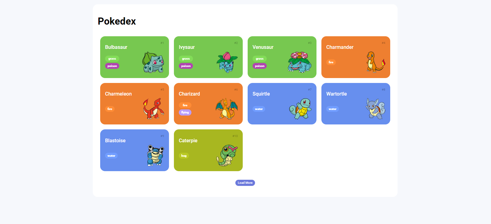

<h1 align="center">Trilha JS Developer - Pokedex</h1>

  

## Descrição do projeto

- É um projeto de desafio de código, com o objetivos de listar pokemons e exibir os detalhes de pokemon usando html, css e javascript vanilla. 

## Funcionalidades do projeto

- `Home` : Lista os 151 primeiros pokemons.

## 📁 Acesso ao projeto

**Em breve...**

## Técnicas e tecnologias utilizadas

* Html
* CSS
* Javascript
* Mobile First

## Autor

 
Bruno Staine Caires de Oliveira 
https://github.com/Brunostaine 